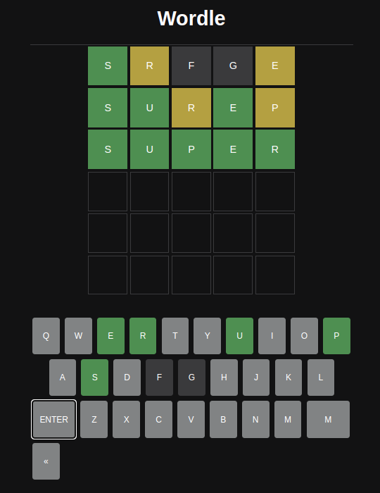

# javascript
Prácticas de Js

 - Wordle en Js.

 (wordle.png)
 

Uso de API: https://rapidapi.com/sheharyar566/api/random-words5/

ATENCIÓN: Necesitas crear un archivo .env en el cual tendrás la info de tu API:
- RAPID_API_KEY='código_de_mi_api'

Instrucciones de uso de la api en la aplicación:
Abrir terminal
- estando en el directorio de la app
- npm init
- npm i axios cors express nodemon
